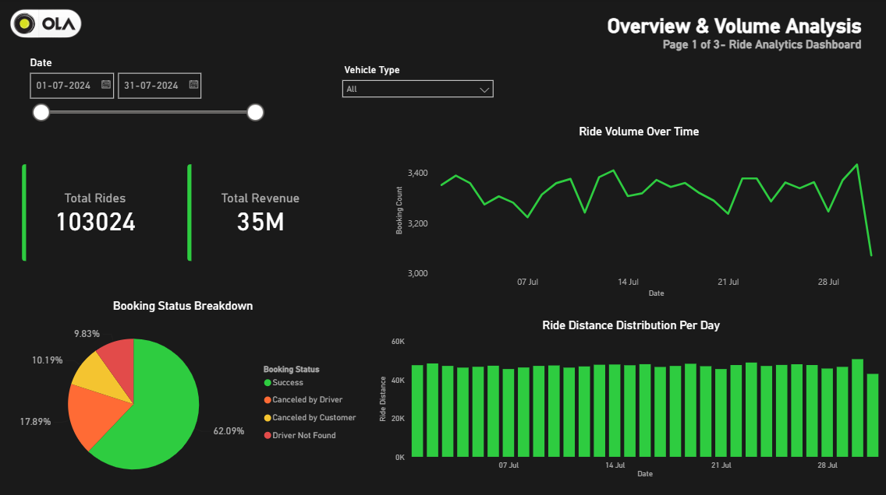
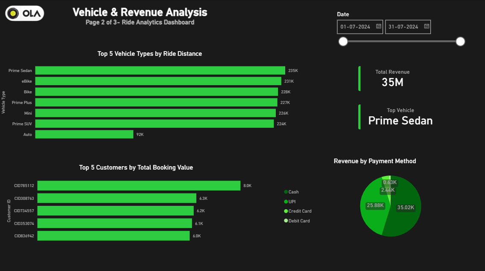

# OLA Ride Analytics Dashboard

## Project Overview

The OLA Ride Analytics Dashboard is a data analytics project designed to analyze ride booking data and uncover meaningful business insights related to ride volume, revenue performance, vehicle utilization, customer behavior, ratings, and ride cancellations.

The project follows a complete analytics workflow involving data preparation in Microsoft Excel, data analysis using PostgreSQL, and dashboard development in Power BI.

---

## Objective

The main objectives of this project are:

* Analyze ride booking trends over time.
* Understand booking success and cancellation patterns.
* Evaluate vehicle category performance.
* Analyze revenue generated through different payment methods.
* Identify high-value customers.
* Compare customer and driver ratings.
* Visualize business insights through an interactive dashboard.

---

## Tools Used

* Microsoft Excel
* PostgreSQL
* Power BI

---

## Dataset Information

The dataset contains ride booking information including operational, financial, and customer-related details.

### Dataset Summary

* Total Records: 103,024
* Total Columns: 19

### Key Columns

* Date
* Time
* Booking ID
* Booking Status
* Customer ID
* Vehicle Type
* Pickup Location
* Drop Location
* V_TAT
* C_TAT
* Cancelled Rides by Customer
* Cancelled Rides by Driver
* Incomplete Rides
* Incomplete Ride Reason
* Booking Value
* Payment Method
* Ride Distance
* Driver Ratings
* Customer Ratings

---

## Data Preparation

The dataset was reviewed and prepared using Microsoft Excel before analysis.

### Data Cleaning Steps

* Reviewed dataset structure.
* Removed duplicate records.
* Verified data consistency.
* Converted dataset into CSV format for PostgreSQL import.

---

## SQL Analysis

PostgreSQL was used to answer business questions and perform data analysis.

### Business Questions Solved

1. Retrieve all successful bookings.
2. Find the average ride distance for each vehicle type.
3. Calculate the total number of rides cancelled by customers.
4. Identify the top 5 customers with the highest number of bookings.
5. Calculate rides cancelled by drivers due to personal and car-related issues.
6. Find maximum and minimum driver ratings for Prime Sedan rides.
7. Retrieve rides where payment was made using UPI.
8. Calculate average customer ratings for each vehicle type.
9. Calculate total booking value of successfully completed rides.
10. List incomplete rides along with their reasons.

### SQL Skills Demonstrated

* SELECT Statements
* WHERE Clause
* Aggregate Functions
* GROUP BY
* ORDER BY
* LIMIT
* Data Filtering
* Business Query Analysis

---

## Power BI Dashboard

The project dashboard consists of three analytical pages.

### Page 1: Overview & Volume Analysis

Features:

* Total Rides KPI
* Total Revenue KPI
* Ride Volume Over Time
* Booking Status Breakdown
* Ride Distance Distribution Per Day

---

### Page 2: Vehicle & Revenue Analysis

Features:

* Top 5 Vehicle Types by Ride Distance
* Top 5 Customers by Total Booking Value
* Revenue by Payment Method
* Revenue KPIs

---

### Page 3: Ratings & Cancellations

Features:

* Average Customer Rating
* Average Driver Rating
* Total Cancellations
* Cancellation Rate
* Customer Cancellation Reasons
* Driver Cancellation Reasons
* Customer vs Driver Ratings Analysis

---

## Key Insights

* More than 103,000 ride records were analyzed.
* Total revenue exceeded 35 million.
* Successful bookings represented the majority of ride activity.
* Prime Sedan emerged as one of the strongest-performing vehicle categories.
* Customer and driver ratings remained consistent across vehicle types.
* Cancellation analysis highlighted operational factors affecting ride completion.
* Revenue and customer value patterns can support business decision-making.

---

## Dashboard Preview

### Overview & Volume Analysis



### Vehicle & Revenue Analysis



### Ratings & Cancellations Analysis


---

## Repository Structure

```text
ola-ride-analytics-dashboard
│
├── Dataset
│   ├── ola_raw_data.xlsx
│   ├── ola_cleaned_data.xlsx
│   └── ola_data.csv
│
├── SQL
│   └── ola_analysis_queries.sql
│
├── Dashboard
│   └── ola_ride_dashboard.pbix
│
├── Screenshots
│   ├── overview_volume_analysis.png
│   ├── vehicle_revenue_analysis.png
│   └── ratings_cancellation_analysis.png
│
├── Documentation
│   └── Project_Report.pdf
│
└── README.md
```

---

## Skills Demonstrated

### Excel

* Data Cleaning
* Duplicate Removal
* Dataset Preparation

### PostgreSQL

* Data Querying
* Aggregation
* Business Analysis
* Data Filtering

### Power BI

* Data Modeling
* Dashboard Design
* KPI Development
* Interactive Reporting
* Data Visualization

### Analytics Skills

* Data Cleaning
* Exploratory Data Analysis
* Business Insight Generation
* Dashboard Development
* Data Visualization

---

## Data Source

Dataset provided as part of a guided analytics project for learning and portfolio development purposes.

---

## Author

Arpit Gupta

Aspiring Data Analyst skilled in Excel, SQL, PostgreSQL, and Power BI, focused on transforming data into actionable business insights.
