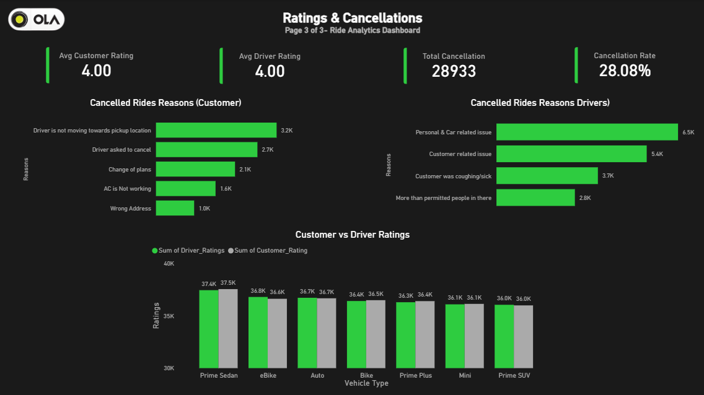

# OLA Ride Analytics Dashboard

An end-to-end Data Analytics project focused on analyzing ride-booking operations using Excel, PostgreSQL, and Power BI. The project explores booking trends, revenue performance, customer behavior, vehicle utilization, ratings, and ride cancellations through SQL analysis and interactive dashboard visualizations.

---

## Project Overview

Ride-hailing platforms generate large volumes of operational data every day. Analyzing this data helps businesses understand customer behavior, improve service quality, reduce cancellations, and optimize revenue.

In this project, ride-booking data was cleaned in Excel, analyzed using PostgreSQL, and transformed into an interactive Power BI dashboard to uncover actionable business insights.

---

## Project Workflow

**Data Cleaning (Excel)**

* Reviewed dataset structure
* Removed duplicate records
* Prepared analysis-ready data

**Data Analysis (PostgreSQL)**

* Wrote SQL queries to answer business questions
* Performed aggregations and trend analysis
* Generated insights from booking and customer data

**Data Visualization (Power BI)**

* Built an interactive dashboard
* Created KPIs and analytical visuals
* Presented insights across multiple business areas

---

## Tools & Technologies

| Tool            | Purpose                               |
| --------------- | ------------------------------------- |
| Microsoft Excel | Data Cleaning                         |
| PostgreSQL      | Data Analysis & Querying              |
| Power BI        | Dashboard Development & Visualization |

---

## Dataset Information

* Total Records: **103,024**
* Total Columns: **19**
* Data Type: Ride Booking Data

### Key Fields

* Booking Status
* Vehicle Type
* Booking Value
* Ride Distance
* Payment Method
* Customer Rating
* Driver Rating
* Pickup Location
* Drop Location
* Cancellation Reasons

---

## Business Questions Solved

### SQL Analysis

* Retrieve successful bookings
* Calculate average ride distance by vehicle type
* Analyze customer cancellations
* Identify top customers by ride count
* Analyze driver cancellation reasons
* Compare driver ratings across vehicle categories
* Analyze UPI transactions
* Calculate average customer ratings
* Measure successful booking revenue
* Investigate incomplete rides

### Dashboard Analysis

* Ride Volume Over Time
* Booking Status Breakdown
* Top Vehicle Types by Ride Distance
* Revenue by Payment Method
* Top Customers by Booking Value
* Ride Distance Distribution
* Customer vs Driver Ratings
* Cancellation Analysis
* Ratings Distribution

---

## Dashboard Highlights

### Overall Performance Dashboard

* Total Rides
* Total Revenue
* Booking Status Analysis
* Daily Ride Trends
* Ride Distance Distribution

### Revenue & Vehicle Analysis

* Revenue by Payment Method
* Top Customers by Booking Value
* Vehicle Performance Analysis
* Ride Distance Comparison

### Ratings & Cancellation Analysis

* Customer Ratings
* Driver Ratings
* Cancellation Rate
* Customer Cancellation Reasons
* Driver Cancellation Reasons

---

## Dashboard Screenshots

### Overview Dashboard


### Revenue & Vehicle Analysis


### Ratings & Cancellation Analysis



---

## Key Insights

* Successful bookings accounted for the majority of ride activity.
* Revenue exceeded ₹35 million across the analyzed dataset.
* Prime Sedan emerged as one of the highest-performing vehicle categories.
* Customer and driver ratings remained consistently high across rides.
* Cancellation patterns highlighted both customer-side and driver-side operational challenges.
* Payment method analysis provided visibility into customer transaction preferences.

---

## Skills Demonstrated

### Data Analysis

* Data Cleaning
* Exploratory Data Analysis (EDA)
* Business Analysis
* Insight Generation

### SQL

* SELECT Statements
* Filtering & Sorting
* Aggregate Functions
* GROUP BY
* ORDER BY
* Data Exploration

### Power BI

* Data Modeling
* DAX Measures
* KPI Design
* Interactive Dashboard Development
* Data Visualization

---

## Repository Structure

```text
ola-ride-analytics-dashboard
│
├── Dataset
│   ├── ola_raw_data.xlsx
│   ├── ola_cleaned_data.xlsx
│   └── ola_data.csv
│
├── SQL
│   └── ola_analysis_queries.sql
│
├── Dashboard
│   └── ola_ride_dashboard.pbix
│
├── Screenshots
│   ├── overview_volume_analysis.png
│   ├── vehicle_revenue_analysis.png
│   └── ratings_cancellation_analysis.png
│
├── Documentation
│   └── Project_Report.pdf
│
└── README.md
```

---

## Data Source

Dataset used for educational and portfolio development purposes as part of a guided analytics project.

---

## Author

**Arpit Gupta**

Aspiring Data Analyst passionate about transforming raw data into meaningful business insights using SQL, Power BI, and Excel.
